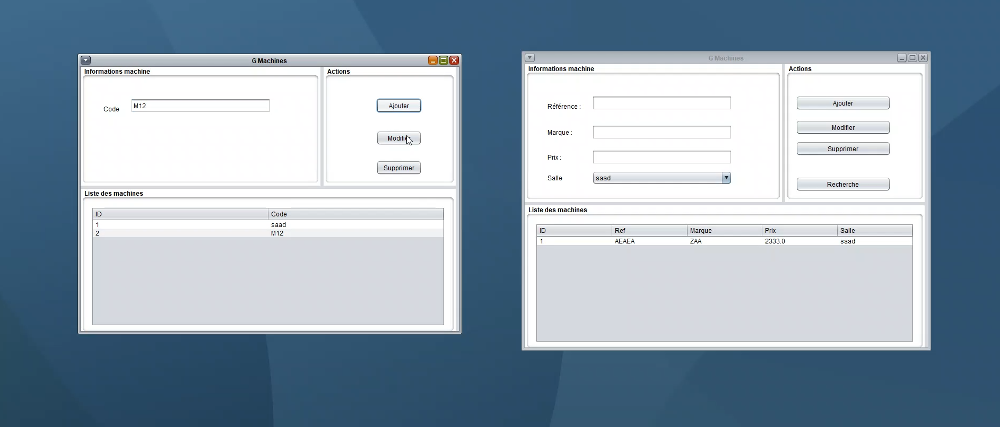
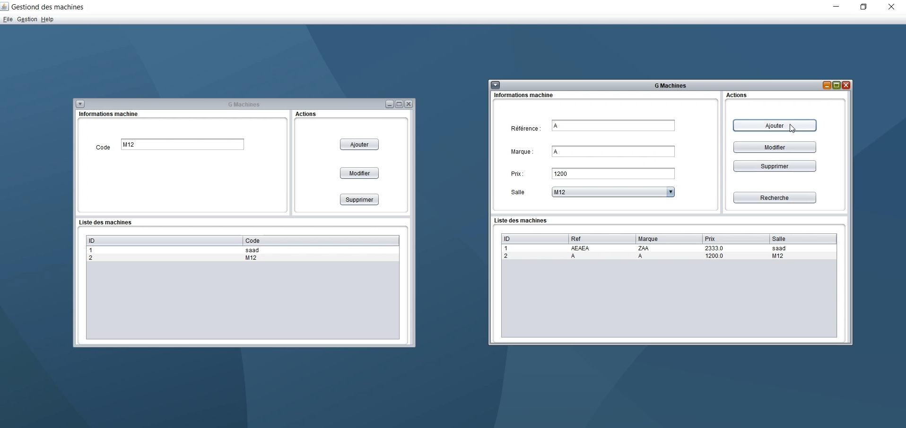

# RMI and Java Swing Project

## Technologies Used
- Java
- RMI (Remote Method Invocation)
- Java Swing

## Features
- **Remote Method Invocation:** The project demonstrates the use of RMI to enable communication between different Java Virtual Machines (JVMs) running on different hosts.
- **Java Swing GUI:** The project includes a graphical user interface created using Java Swing, providing users with an intuitive and interactive experience.
- **Distributed System:** The application is designed as a distributed system, where different components can communicate with each other over a network.

## Getting Started

### Prerequisites
- Java Development Kit (JDK) installed on your system
- Basic understanding of Java programming, RMI, and Java Swing

### Installation
1. Clone the repository:
2. Compile the Java files:
3. Start the RMI registry on the server:
4. Run the server application:
5. Run the client application on a different host:

## Usage
1. Launch the client application to access the graphical user interface.
2. Use the provided interface to interact with the distributed system.
3. Explore different functionalities and observe how RMI enables remote method invocation between the client and server components.

## Demonstration

